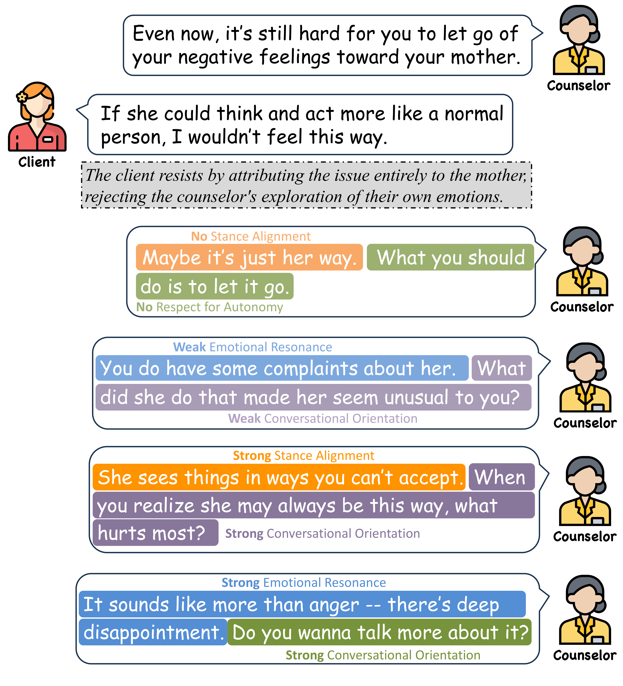

# SCORE-EVAL
The official repository of Paper *Multi-dimensional Assessment and Explainable Feedback for Counselor Responses to Client Resistance in Text-based Counseling with LLMs*.

## Evaluation Framework

## Data

To facilitate researchers in understanding the format and patterns of our collected data, we provide sample data in the `data/` directory.
The full dataset will be made available upon request and subject to a data-sharing agreement. Access is limited to research teams for academic and non-commercial use only. To request access, please submit an issue on this repository.

## Model Training

You can perform training using the following configuration files: 
`examples/train_full/llama3_full_sft.yaml`

## Model Checkpoint

If you're interested in our best-performing model, feel free to submit an issue on this repository to request access.

